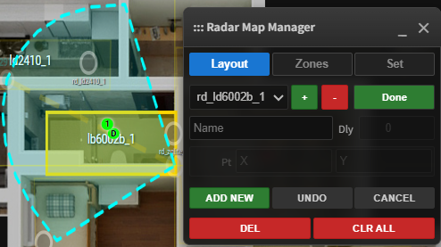
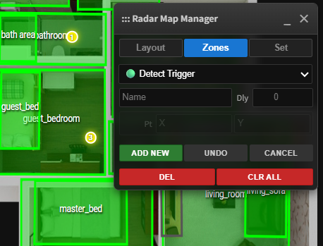
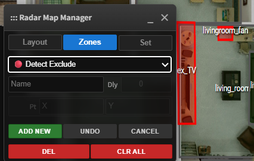

# Radar Map Manager (RMM)


[](https://github.com/hacs/integration)

> 🇺🇸 **English User?** [Click here for English Documentation](README.md)

**Radar Map Manager (RMM)** 是专为 Home Assistant 打造的毫米波雷达可视化与数据融合集成。

它不仅仅是一个户型图卡片，更是一个**空间感知引擎**。RMM 能将家中分散的多个毫米波雷达的数据统一映射到您的一个或多个户型图上，实现全屋人员定位追踪、轨迹可视化以及基于精确坐标的自动化触发。

> 🚀 **V1.0.0 正式发布！** 支持多户型图，支持雷达侧装/顶装模式 (Ceiling Mount)、`Monitor` / `Detect Trigger` / `Detect Exclude` 三种区域管理，融合多雷达目标，以及更丝滑的编辑器体验。

---

## ✨ 核心功能

### 1. 🎯 所见即所得的可视化编辑器
抛弃繁琐的 YAML 坐标计算！RMM 提供了一个交互式的前端编辑器：
* **配置/展示双模式**：支持**配置模式 (config)** 和 **展示模式 (read_only)** 两种模式，配置、展示两不误。
* **多户型/楼层支持**：支持**多户型（map_group）** 轻松管理多个楼层和地点，为你的家庭、办公室设置独立的视图。
* **灵活自由的雷达配置**：直接在户型图上拖拽雷达位置，支持雷达的旋转、缩放和镜像翻转，一站式管理雷达。
* **自动定位缩放**：通过freeze功能，可以可视化的定位雷达目标在户型图上的相对位置，让你轻松调整雷达缩放，告别忙猜。
* **雷达安装方式支持**：完美支持 **侧装 (Side Mount)** 和 **顶装 (Ceiling Mount)** 雷达。

### 2. 🌐 多雷达数据融合 (Sensor Fusion)
RMM 的目标融合引擎能将多个雷达的目标点统一到一个坐标系中：
* **自动聚类**：当多个雷达探测到同一个人时，自动合并为一个目标，避免“影分身”，融合范围支持自定义。
* **盲区互补**：通过多雷达叠加，消除房间内的探测死角。

### 3. 🛡️ 灵活的区域管理 (Zones Manager)
支持绘制任意形状的多边形区域，灵活的编辑方式让你轻松管理：
* **雷达监测区 (`Monitor Zones`)**：为每个雷达单独设置监测区，只有进入该区域才会触发该雷达的目标融合与显示；如果不设置则默认全局融合。
* **全局监测区 (`Detect Trigger`)**：**自动化神器！** 在户型图上自由设置监测区，当融合目标进入该区域后，会触发 HA 的实体（自动生成）。
    * 支持自定义 **触发延迟 (Delay)**，有效避免误报。
* **全局排除区 (`Detect Exclude`)**：**解决误报的神器！** 在地图上圈出风扇、窗帘或绿植的位置，将其设为“排除区”，引擎会自动过滤掉该区域内的所有干扰信号。
* **自动化实体**：每个全局监测区都会自动生成 **存在实体 (`binary_sensor`)** 和 **人数实体 (`sensor`)**。
    * *场景举例*：“人坐在沙发上打开电视”、“人走进浴室不同区域调整灯光”。

### 4. 📐 3D 空间修正
针对侧装雷达，RMM 内置了 3D 修正算法。根据雷达安装高度和目标高度，自动将斜距 (Slant Range) 还原为地距 (Ground Distance)，大幅提高定位精度。

---

## 🛠️ 支持的硬件

RMM 兼容所有能够接入 Home Assistant 的毫米波雷达（包括 1D/2D/3D 雷达），只要它们能提供 `DISTANCE` 或者 `X`/`Y` 坐标数据。

### 连接方式
* **ESPHome** (推荐)
* **MQTT**
* **Zigbee** (需支持坐标上报)

### ⚠️ 坐标实体命名规范 (重要)
为了确保系统能正确识别雷达数据，请务必遵循以下命名格式：

1.  **1D 雷达**：
    * 格式：`sensor.[radar_name]_distance`
    * *例如：`sensor.rd_ld2410_distance`*
2.  **2D/3D 雷达**：
    * 格式：`sensor.[radar_name]_target_?_x` (包含 `_x`, `_y`, `_z`)
    * *例如：`sensor.rd_ld6004_target_1_x`*
3.  **雷达目标数 [可选]**：
    * 格式：`sensor.[radar_name]_presence_target_count`
    * *例如：`sensor.rd_ld2450_presence_target_count`*

---

## 📦 安装方法

### 方式一：HACS 自动安装 (推荐)
1.  打开 HACS -> Integrations。
2.  点击右上角菜单 -> **Custom repositories**。
3.  填入本仓库地址 `https://github.com/Moe8383/radar_map_manager`，类别选择 **Integration**。
4.  搜索 "Radar Map Manager" 并点击安装。
5.  重启 Home Assistant。

### 方式二：手动安装
1.  下载本仓库的 `custom_components/radar_map_manager` 文件夹。
2.  将其复制到您 HA 配置目录下的 `custom_components/` 中。
3.  重启 Home Assistant。

---

## ⚙️ 配置指南

### 第一步：添加集成
1.  前往 **配置** -> **设备与服务** -> **添加集成**。
2.  搜索 **Radar Map Manager** 并添加。

### 第二步：添加卡片
1.  在仪表盘点击“编辑仪表盘” -> “添加卡片”。
2.  搜索 **Radar Map Manager** 卡片。
3.  或者使用以下 YAML 配置：

**独立使用（manual-card）：**
```yaml
type: custom:radar-map-card
map_group: default                     # 可选，户型图/楼层名称，默认default
read_only: false                       # 可选，true为编辑模式，false为展示模式，默认false
bg_image: /local/floorplan/house.png   # 编辑模式下必填，户型图图片
target_radius: 5                       # 可选，融合目标大小
show_labels: true                      # 可选，显示区域名称
handle_radius: 1.5                     # 可选，区域端点大小
handle_stroke: 0.2                     # 可选，区域激活端点大小
zone_stroke: 0.5                       # 可选，区域线条粗细
label_size: 2                          # 可选，区域名称字体大小
target_colors:                         # 可选，雷达原始目标自定义颜色
  - yellow
  - "#00FFFF"
  - "#FF00FF"
```
**在picture-elements卡片中使用：**
```yaml
type: picture-elements
image: /local/floorplan/3dplan/blank_floor.png
elements:
  - type: custom:radar-map-card
    target_radius: 5
    read_only: true
    style:
      top: 50%
      left: 50%
      width: 100%
      height: 100%
      transform: translate(-50%, -50%)
      pointer-events: none
```

---

## 🪄 编辑模式使用指南

点击卡片右上角的⚙️，进入编辑模式。

### A. 📡 雷达布局（Layout）

点击面板中的 `Layout` 进入雷达布局模式，此时显示的目标是雷达的原始坐标（1D雷达目标用D标签显示）。


#### 1. 添加/删除雷达

* 添加：点击 `+` 号，输入在HA中的雷达名称，如雷达的坐标为 `sensor.rd_ld2450_target_1_x`，则输入雷达名称：`rd_ld2450`

* 删除：选中已添加的雷达，点击 `-` 号，删除该雷达，慎重操作。

#### 2. 雷达设置


* 雷达定位：拖动雷达到实际摆放的位置，拖动雷达“把手”选择角度。位置和角度可以通过面板的`X`/`Y`/`Rot`进行微调。

* 调整比例：站在雷达监测范围内（建议尽量远离中线，并尝试多个位置提高精准度），建议综合采用以下几种方法，使雷达目标与户型图吻合：

  * 方法一（推荐）：点击 `Freeze` 按钮，会锁定雷达识别的第1个目标，手动拖动该目标至你所处于的户型图位置，会自动计算缩放比例
  * 方法二：通过调整面板中的 `ScX` 和 `ScY` ，调整 `X`/`Y` 坐标的显示比例
  * 方法三：点击 `Ax`/`Ay` 会根据背景图比例自动调整（供参考）
  

* 安装方式：勾选面板底部的 `Ceiling` , 切换“侧装/顶装”安装方式

* 镜像模式：勾选面板底部的 `Mirror` ， 反转雷达 X 轴

* 3D矫正： 勾选面板底部的 `3D`，输入雷达安装高度（单位：米），将进行目标3D矫正。如果雷达安装高度在建议范围内，可以不选择3D矫正。注：顶装模式下无需开启此项。

* `UNDO`：撤销上一步操作

#### 3. 雷达监测区域设置




* 通过面板或底图选中某个雷达，点击面板 `Monitor` 按钮，进入该雷达的监测区域设置

* 新增区域：点击 `ADD NEW` 按钮，进入添加区域模式，通过选定多边形端点确定形状，并为区域命名，点击 `FINISH` 确认保存

* 调整区域：选中某区域，通过拖动端点，可以灵活调整区域形状，双击某个端点可以删除该端点

* 删除区域：选中某区域，点击 `DEL` 可以删除选中的区域；点击 `CLR ALL` 删除该雷达下的所有Monitor区域（审慎操作！！！）

* 点击 DONE 退出Monitor区域编辑


### B. 🛡️ 区域管理（Zones）

点击面板中的 `Zones` 进入区域管理模式。

   注意：Zones 是基于融合后的坐标进行判断的，不依赖于特定雷达。此时地图上显示的是融合后的目标（默认为金色）。


#### 1. Detect Trigger 区域



* 编辑操作与 Monitor 区域相同。

* `Dly` (延迟)：支持设置目标进入/离开的消抖延迟（单位：秒），避免误报。

* 用途：设置后会自动创建 `binary_sensor` (存在) 和 `sensor` (人数) 实体，用于自动化。


#### 2. Detect Exclude 区域



* 编辑操作与 Monitor 区域相同。

* 用途：落入该区域的融合目标会被直接丢弃，不显示、不触发。适用于排除风扇、空调、绿植等固定干扰源。

### C. ⚙️ 参数设置（Set）

点击面板中的 `Set` 进入参数设置


* `Updata`: 雷达目标刷新频率

* `Merge`: 雷达目标融合距离（单位：米）。小于该距离的不同雷达目标将被合并为一个。

* `Tgr_H`: 目标质心高度，用于3D矫正

* `Color`: 自定义融合目标的显示颜色

* `Backup` / `Restore`: 导出或导入 JSON 配置文件，方便备份与迁移。


## ❤️ 支持项目
如果你觉得这个项目对你有帮助，请给它点个 **⭐️ Star**！

[](https://www.buymeacoffee.com/moe8383)
[](https://afdian.com/a/moe8383)

* **问题反馈 (Bugs)**：请提交 [Issue](https://github.com/Moe8383/radar_map_manager/issues)。
